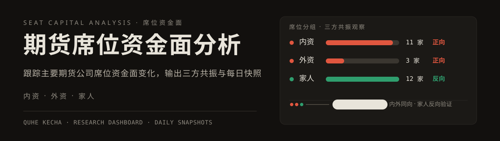

# 期货席位资金面分析
<p align="center">
  
</p>

本项目用于跟踪奇货可查主要期货公司席位资金面变化，并更新本地静态研究工作站与主力趋势表格辅助文件。

## 数据来源

- 奇货可查席位持仓页：`https://x.qhkch.com/broker/position`
- 奇货可查品种持仓结构页：`https://x.qhkch.com/variety/structure`
- 奇货可查品种概览与主力合约多空席位：`https://x.qhkch.com/variety`
- 交易可查品种持仓结构（奇货可查同日净多/净空证据不完整时的备选源；需具备可读取的登录态）：`https://www.jiaoyikecha.com/#/variety/structure`
- OpenVLab 图表/期权页：`https://www.openvlab.cn/chart/light/`
- 奇货可查 AI 天眼天气风险：`https://eye.qhkch.com/?view=overview`
- BW Research 持仓分析参考：`https://bwresearch.club/reports/brokerseats/`

## 当前席位分组

- 内资：国泰君安、东证期货、永安期货、海通期货、浙商期货、中财期货、南华期货、申银万国、一德期货、瑞达期货、银河期货
- 外资：高盛期货、摩根大通、瑞银期货
- 家人：东方财富、徽商期货、方正中期、华安期货、中信建投、广发期货、民生期货、平安期货、中泰期货、光大期货、招商期货、中信期货；其中中信期货前台标记为“亏损机构（特殊）”

席位名称以网页实际可返回持仓表的名称为准；用户简称只作为别名。原“乾坤期货”已按现名“高盛期货”处理。

数据生产脚本统一使用上述内资、外资与家人样本；工作站重点观察内外资同向共振，以及家人席位反向后的三方共振。

## 当前分析口径

- 加多或减空计为偏多；减多或加空计为偏空。
- 品种层面合并同一席位下所有合约的多头、空头持仓及日变化。
- 内资、外资按正向资金解读；家人席位按反向指标解读。
- 日报重点输出反向共振品种、三组最强偏多/偏空品种、家人反向解读，以及强共振品种最近 5 个可用披露日的持续/反转。
- 不再输出单席位 40% 阈值观察；EC 集运欧线因网页无持仓数据，不纳入重点持仓观察。
- 中文交易语境下，看多/上涨/正向使用红色；看空/下跌/负向使用绿色。
- 日常工作流不再生成两份日报 HTML；两份脚本默认只作为研究工作站的结构化数据生产与对账层。仅在手动诊断时设置 `WRITE_REPORT_HTML=1` 才写出旧版日报 HTML。
- 两份日报均取消共振地图/散点象限地图；机构合并专题和保证金金额口径日报是后续主要观察版本。
- 机构合并专题和保证金金额口径日报新增“期货资金潮汐”模块：当前无行情涨跌字段时，以资金净流入/流出 × 总持仓增/减判断资金潮汐；接入行情源后可升级为资金流入/流出 × 上涨/下跌四象限。
- 核心品种/边际矩阵应以同一行内条形刻度、进度条等方式可视化内资、外资、家人相对变化，避免只列纯数字。
- 机构专题的核心品种全景同时展示当前净持仓与今日边际变化；农产品板块加入 AI 天眼的当日及未来天气风险，并将天气事实与席位资金验证分列。
- 保证金日报保留商品主分析，并单独增加股指资金与趋势观察：席位金额只统计上证 50、沪深 300、中证 500、中证 1000 股指期货；科创 50、创业板 50 仅在趋势动物可定位且数据日有效时展示趋势和日收益原值。
- 工作站板块口径：贵金属、有色金属、家人品种、黑色系、油化工、谷物饲料、油脂油料、农副软商；不再设置“其他商品”。玻璃、纯碱、氧化铝、烧碱、多晶硅、纸浆归入“家人品种”。淀粉 `CS`、铝合金 `AD`、丙烯 `PL`、粳米 `RR`、棉纱 `CY`、双胶纸 `OP`、油菜籽 `RS` 不进入工作站，除非用户以后明确要求恢复。
- 保证金金额口径日报优先读取趋势动物 API 生成的 `data/trend_temperature_YYYYMMDD.csv`，否则才读取 `data/trend_temperature_latest.csv`，并新增“趋势温度与资金共振”模块。趋势温度仅纳入 `温/热/沸/凉/寒/冻`，过滤 `平`；`温/凉`为左侧预警，`热/寒`为右侧确认，`沸/冻`为极端警戒；资金关系用三方净金额 `内资 + 外资 - 家人` 判断顺势、逆势或未验证。API 直接事实和资金判断在报告中分列；文档未定义单位的字段按原值展示。

## 重点品种

当前固定重点品种为：燃油、苯乙烯、碳酸锂、豆粕、鸡蛋、焦煤、铁矿石、沪金、沪银、欧线集运、生猪、棕榈油、天然橡胶主力合约。

结构页抓取名称按奇货可查页面映射：沪金 -> 沪金，沪银 -> 沪银，欧线集运 -> 集运欧线。重点品种持仓结构只展示净多前 5 与净空前 5 席位构成；欧线集运因奇货可查无可用持仓数据，不参与席位合计或结构页结论。品种结构页交叉验证仅后台写入 CSV，不单独展示在 report 页面。

## 登录状态

品种持仓结构页通常需要登录态。后续运行时优先使用 Chrome 插件/浏览器缓存中的已登录状态；若不可用，再临时登录并只通过环境变量传递会话 Cookie。不得把账号、密码、Cookie 或令牌写入项目文件、报告或日志。

## 休市日处理

日报只在中国期货市场交易日生成。2026 年法定节假日或调休放假日不做席位分析；自动化已同步跳过元旦、春节、清明节、劳动节、端午节、中秋节和国庆节放假区间。

## 常用命令

Windows PowerShell 下不要使用 Bash 风格 heredoc；临时 Python 校验请使用原生 `python -c "..."`，或直接运行项目已有脚本。

每次更新数据或工作站结构前，先在干净工作树同步远端：

```powershell
git fetch origin main
git pull --rebase origin main
```

完成验证后，只提交本次相关文件并推送 `origin/main`；临时文件、账号状态与未审阅改动不纳入提交。

更新机构席位数据层：

```powershell
$env:REPORT_DATE="YYYYMMDD"; python scripts/generate_institutional_seat_report.py
```

手动诊断时生成旧版机构日报 HTML：

```powershell
$env:REPORT_DATE="YYYYMMDD"; $env:WRITE_REPORT_HTML="1"; python scripts/generate_institutional_seat_report.py
```

外资席位不再单独生成专题日报；机构合并专题日报统一介绍内资、外资和家人共振情况。
旧全席位日报不再作为每日正式输出；如需临时排查旧口径，可手动运行 `scripts/generate_futures_report.py`。

更新保证金金额数据层：

```powershell
$env:REPORT_DATE="YYYYMMDD"; python scripts/generate_margin_weighted_seat_report.py
```

手动诊断时生成旧版保证金日报 HTML：

```powershell
$env:REPORT_DATE="YYYYMMDD"; $env:WRITE_REPORT_HTML="1"; python scripts/generate_margin_weighted_seat_report.py
```

生成当日趋势动物 API 快照后再生成保证金日报：

```powershell
$env:TREND_ANIMAL_API_KEY="<secure-session-key>"; $env:REPORT_DATE="YYYYMMDD"; python scripts/fetch_trend_animal_snapshot.py
$env:REPORT_DATE="YYYYMMDD"; python scripts/generate_margin_weighted_seat_report.py
```

API Key 仅可存在于当前安全会话环境变量中。脚本每日调用一次，先检查商品期货与所选指数的数据日期和实时字段计费，再抓取燃油、苯乙烯、碳酸锂、豆粕、鸡蛋、焦煤、沪金、沪银、欧线集运、生猪，以及股指板块所需的最小快照字段。费用不再作为调用前阻断条件；脚本会在调用后读取当日账单，只有当日实际消费超过 1 元时输出提醒，且不落盘余额或账单明细。详情见 `docs/trend-animal-api.md`。

生成知识星球 A 股社区情绪摘要后再生成保证金日报：

```powershell
$env:REPORT_DATE="YYYYMMDD"; python scripts/fetch_zsxq_equity_sentiment.py
$env:REPORT_DATE="YYYYMMDD"; python scripts/generate_margin_weighted_seat_report.py
```

该脚本复用 `zsxq-cli` 的安全登录态，读取“趋势小程序”知识星球报告日内帖子、评论与 Nick 的当日发帖/回复，输出脱敏 CSV/JSON。保证金日报股指板块将社区事实、Nick 观点和规则化风险偏好判断分列；它不是股指涨跌预测。账号、Cookie、token、签名媒体 URL 和完整原帖不得落盘。

保证金表默认 7 天内复用 `data/margin_reference.csv` 缓存；需要强制刷新东方财富保证金表时：

```powershell
$env:FORCE_MARGIN_REFRESH="1"; $env:REPORT_DATE="YYYYMMDD"; python scripts/generate_margin_weighted_seat_report.py
```

主要输出目录：

- `output/institutional_seat_report_YYYYMMDD/report.html`
- `output/institutional_seat_report_YYYYMMDD/data/`
- `output/margin_weighted_seat_report_YYYYMMDD/report.html`
- `output/margin_weighted_seat_report_YYYYMMDD/data/`
- `output/main_trend_update_YYYYMMDD/`

## 交易系统文档

- `docs/trading-system.md`：唯一主文档，包含三层能力、五问分析、开仓闸门、工具选择、仓位退出和冷却规则。
- `docs/trading-decision-checklist.md`：每笔交易前使用的十问清单，硬纪律也统一放在这里，不再单独建立纪律文档。
- `docs/trading-philosophy.md`：只保留长期市场观、风险观和情绪原则，不承担具体开平仓判断。
- `docs/technical-analysis-framework.md`：需要判断图形和执行位置时使用，按大周期、中周期和小周期分析。
- `docs/trading-log-framework.md`：负责固化开仓假设、开盘前与收盘后的持仓审计、平仓归因和每周复盘。
- `docs/yuque-integration.md`：语雀 CLI/MCP 连接方案。

日常使用顺序：先用主系统形成交易假设，再用决策清单决定是否下单；需要图形判断时打开技术框架，持仓期间每天填写两次审计卡，交易结束后完成归因。交易哲学只在复盘系统和校正心态时回看。

## 商品期货与期权过滤口径

机构专题只观察商品期货。保证金日报的商品主体同样排除股指、国债和外盘，但另设股指专栏读取 `IH/IF/IC/IM`；股指数据写入独立 CSV，不混入商品板块、共振和保证金覆盖率。国债与外盘仍不纳入两份正式日报。

期权波动率 demo 脚本为：

```powershell
$env:REPORT_DATE="YYYYMMDD"; python scripts/generate_option_vol_report.py
```

该脚本输出 `output/option_vol_report_YYYYMMDD/report.html`，观察用户关注的商品期权合约，并尝试从 OpenVLab market、行情 light 页面和 volatility analysis 页面读取隐波、实波、偏度、隐波百分位、偏度百分位及 5 日变化。若公开页面只返回动态前端壳或历史接口不可见，报告必须标注抓取状态，不得把截图样例或缺失数据伪装成实时确认数据。

## 研究工作站数据构建

`scripts/build_research_dashboard.py` 将席位、保证金、行情、趋势、技术面和基本面底表合并为只读历史快照，并生成统一网页：

```powershell
$py="C:\Users\29266\.cache\codex-runtimes\codex-primary-runtime\dependencies\python\python.exe"
$env:REPORT_DATE="YYYYMMDD"
& $py scripts\generate_institutional_seat_report.py
& $py scripts\generate_margin_weighted_seat_report.py
& $py scripts\fetch_eastmoney_main_quotes.py
& $py scripts\fetch_sina_quhe_main_quotes.py
& $py scripts\fetch_research_dashboard_market_context.py
& $py scripts\fetch_eastmoney_technical_snapshot.py
& $py scripts\build_research_dashboard.py
```

当前 MVP 包含总览、历史日期切换、品种详情、品种全景、CTA 评分和历史回看；总览中的强共振卡可直接进入对应品种详情。CTA 与工作站共用日期快照，按量价、席位存量、席位边际、基差仓单和期权偏度的可用权重重算，并把 `IH/IF/IC/IM` 单列为“股指”板块。行情采集会先校验奇货可查商品概览是否仍保留报告日的完整精确截面：匹配时同步保存主连行情与主力席位，不匹配才回退报告日精确日线。构建前强制复核同日 `qhkch_main_position_rows_YYYYMMDD.csv`：每个工作站商品必须同时具备精确主力合约的净多前五和净空前五，否则构建失败并列出缺失品种，不再用样本席位底表静默补位。趋势动物只提供趋势温度和强度，行情与趋势事实分列。页面只消费已生成底表，不改变三方计算逻辑。行情、趋势或截图来源日期与报告日不一致时会明确标记为非当日或不采用。

完整的每日执行、截图补录、席位复核、双仓同步和线上验收规则见 `docs/daily-data-update-handoff.md`。

主要输出：

- `output/research_dashboard/index.html`
- `output/research_dashboard/data/dashboard.json`
- `output/research_dashboard/data/snapshots/YYYYMMDD.json`
- `data/eastmoney_main_quotes_YYYYMMDD.csv`
- `data/eastmoney_main_quotes_status_YYYYMMDD.json`
- `data/ths_main_quotes_YYYYMMDD.csv`（有用户截图时的 10/20/30 日涨幅、增减仓与资金流）
- `data/openvlab_option_factors_YYYYMMDD.csv`（有用户截图时的期权截面）

### 长图版候选工作流

研究工作站总览统一承接三方强共振、资金潮汐、板块前三净多/净空、核心品种全景、内外资及家人反向席位贡献、独立股指和来源状态。任一品种可继续进入净持仓前五、三组存量与边际、行情趋势事实、基本面证据和历史路径。

沪银 `AG`、焦煤 `JM`、燃料油 `FU`、生猪 `LH`、碳酸锂 `LC`、鸡蛋 `JD` 已接入技术面详情：`scripts/fetch_eastmoney_technical_snapshot.py` 优先锁定报告日主力合约，只保留日线与 60 分钟两级观察，并结合简化缠论、动量、EMA5/20/60、成交量和持仓量判断“偏多 / 中枢震荡 / 偏空”。中枢边界与 EMA 共同生成最近支撑压力。品种详情顶部使用“品种下拉 + 可选搜索 + 板块筛选”，当前商品均可进入详情；技术面仍只覆盖上述 6 个品种。技术指标为本地确定性计算，不消耗 LLM token；当前主力合约历史不等同于复权连续合约，简化缠论也不等同于严格背驰或买卖点确认。

线上工作站由公开仓 `EvanYFM/futures-workstation` 的 GitHub Pages 承载，只接收已验证的静态代码、行情、席位、资金和 CTA 数据，不复制或重算资金逻辑。个人复盘与交易记录存放在独立私有数据仓，不得进入公开仓。旧 `sites/research_dashboard/` 包装不再属于每日发布链路。

原 `output/research_dashboard_v2_mockup/index.html` 的交互概念已经合并进主工作站“品种详情”视图。强共振、板块和核心品种均可进入统一详情，依次展示行情与资金图、证据链摘要、三组存量/边际、席位前五、趋势周期、基本面事实和历史事件。主力期现基差与交易所仓单已按公开源生成历史图；供给、需求、现金成本和产业库存按 `config/fundamental_sources.json` 展示首选来源与授权状态，没有连续数值时保留缺失，不使用概念稿示意数字。

构建时会把每个交易日固化为独立 `snapshots/YYYYMMDD.json`，主页面只汇总快照，因此历史数据不会被次日覆盖。日常更新执行“抓取结构化数据 -> 写入并校验每日快照 -> 同步私有开发仓 -> 同步公开部署仓并在线验证 Pages”，不再生成或启动本地 HTTP 工作站。两份日报脚本保留为数据生产和对账层，但默认跳过 HTML。期货通和 OpenVLab Legend 截图未提供时明确保留缺失，不沿用旧截图；用户补发对应交易日截图后重建并重新发布同日快照。
